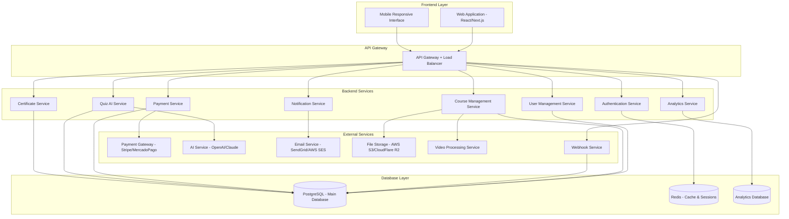
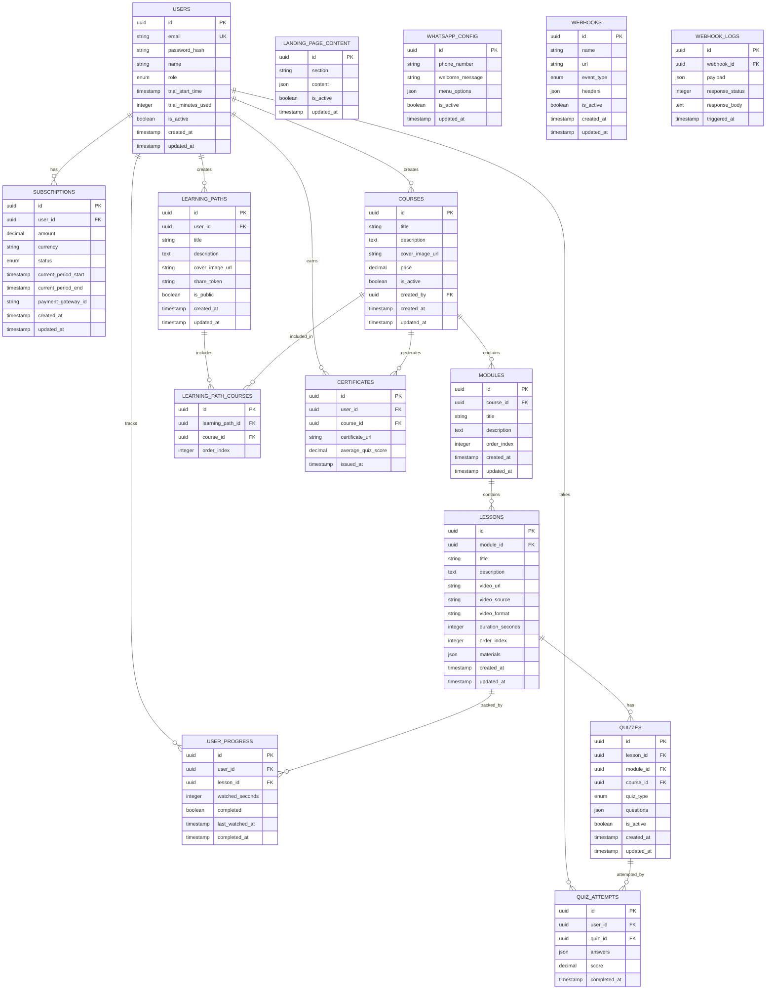

# Design Document

## Overview

A plataforma de cursos online será desenvolvida como uma aplicação web moderna e responsiva, seguindo arquitetura de microserviços com separação clara entre frontend e backend. O sistema suportará dois tipos principais de usuários (administradores e alunos) com funcionalidades específicas para gestão de conteúdo, pagamentos recorrentes, sistema de teste gratuito baseado em tempo de uso, quizzes gerados por IA e certificados automáticos.

### Principais Características Técnicas
- Arquitetura RESTful API com autenticação JWT
- Sistema de streaming de vídeo com controle de progresso
- Integração com gateway de pagamento para cobrança recorrente
- Sistema de IA para geração automática de quizzes
- Geração automática de certificados em PDF
- Interface responsiva para todos os dispositivos
- Sistema de notificações por email e push

## Architecture

### High-Level Architecture



### Database Design



## Components and Interfaces

### Frontend Components

#### 1. Landing Page Components
- **Hero**: Seção principal com call-to-action para teste gratuito
- **FeaturesSection**: Seção destacando principais funcionalidades
- **TestimonialsCarousel**: Carrossel com depoimentos de alunos
- **PricingSection**: Seção com planos e preços (destaque para teste gratuito)
- **CoursePreview**: Preview de cursos populares para visitantes
- **FAQ**: Seção de perguntas frequentes
- **WhatsAppFloatingButton**: Balão flutuante fixo para contato via WhatsApp
- **WhatsAppMenu**: Menu expansível com opções de mensagens pré-definidas
- **Footer**: Rodapé com links importantes e contato

#### 2. Authentication Components
- **LoginForm**: Formulário de login com validação
- **RegisterForm**: Formulário de cadastro com validação de email
- **PasswordReset**: Componente para recuperação de senha
- **TrialTimer**: Componente que exibe tempo restante do teste gratuito

#### 3. Course Management Components
- **CourseList**: Lista de cursos com filtros e busca
- **CourseCard**: Card individual do curso com informações básicas
- **CoursePlayer**: Player de vídeo com controles personalizados
- **ProgressBar**: Barra de progresso da aula/curso
- **MaterialsPanel**: Painel lateral com materiais complementares

#### 4. Admin Components
- **AdminDashboard**: Dashboard principal com métricas
- **CourseEditor**: Editor completo de cursos e módulos
- **UserManagement**: Gestão de usuários e assinaturas
- **AnalyticsPanel**: Painel de relatórios e analytics
- **QuizConfiguration**: Configuração de quizzes por curso/módulo
- **LandingPageEditor**: Editor completo da landing page com seções dinâmicas
- **WhatsAppConfiguration**: Configuração de mensagens e opções do WhatsApp
- **VideoUploader**: Interface para adicionar links do Google Drive e OneDrive
- **WebhookManager**: Gerenciamento completo de webhooks para eventos

#### 5. Quiz and Certificate Components
- **QuizModal**: Modal para exibição de quizzes
- **QuizQuestion**: Componente individual de pergunta
- **CertificateViewer**: Visualizador de certificados
- **CertificateGenerator**: Gerador de certificados em PDF

#### 5. Learning Path Components
- **LearningPathCreator**: Criador de trilhas de aprendizado
- **LearningPathViewer**: Visualizador de trilhas compartilhadas
- **ShareModal**: Modal para compartilhamento de trilhas

### Backend API Endpoints

#### Authentication Service
```
POST /api/auth/register
POST /api/auth/login
POST /api/auth/refresh
POST /api/auth/forgot-password
POST /api/auth/reset-password
GET  /api/auth/me
```

#### User Management Service
```
GET    /api/users/profile
PUT    /api/users/profile
GET    /api/users/subscription
POST   /api/users/subscription/cancel
GET    /api/users/trial-status
GET    /api/admin/users
PUT    /api/admin/users/:id/status
```

#### Course Management Service
```
GET    /api/courses
GET    /api/courses/:id
POST   /api/courses (admin)
PUT    /api/courses/:id (admin)
DELETE /api/courses/:id (admin)
GET    /api/courses/:id/modules
POST   /api/courses/:id/modules (admin)
GET    /api/modules/:id/lessons
POST   /api/modules/:id/lessons (admin)
GET    /api/lessons/:id/progress
PUT    /api/lessons/:id/progress
```

#### Payment Service
```
POST /api/payments/create-subscription
POST /api/payments/webhook
GET  /api/payments/invoices
```

#### Quiz Service
```
GET  /api/quizzes/lesson/:lessonId
GET  /api/quizzes/module/:moduleId
GET  /api/quizzes/course/:courseId
POST /api/quizzes/generate (admin)
POST /api/quizzes/:id/attempt
GET  /api/quizzes/:id/attempts
```

#### Certificate Service
```
GET  /api/certificates/user/:userId
POST /api/certificates/generate
GET  /api/certificates/:id/download
```

#### Learning Path Service
```
GET    /api/learning-paths/user/:userId
POST   /api/learning-paths
PUT    /api/learning-paths/:id
DELETE /api/learning-paths/:id
GET    /api/learning-paths/shared/:token
```

#### Landing Page Service
```
GET    /api/landing/content
PUT    /api/landing/content (admin)
GET    /api/landing/courses-preview
GET    /api/landing/testimonials
GET    /api/landing/stats
POST   /api/landing/contact
GET    /api/landing/whatsapp-config
PUT    /api/landing/whatsapp-config (admin)
```

#### Video Service
```
POST   /api/videos/validate-link (admin)
GET    /api/videos/stream/:id
GET    /api/videos/metadata/:id
PUT    /api/videos/:id/link (admin)
```

#### Webhook Service
```
GET    /api/webhooks (admin)
POST   /api/webhooks (admin)
PUT    /api/webhooks/:id (admin)
DELETE /api/webhooks/:id (admin)
POST   /api/webhooks/test/:id (admin)
POST   /api/webhooks/trigger
```

## Data Models

### Core Models

#### User Model
```typescript
interface User {
  id: string;
  email: string;
  name: string;
  role: 'admin' | 'student';
  trialStartTime: Date | null;
  trialMinutesUsed: number;
  isActive: boolean;
  subscription?: Subscription;
  createdAt: Date;
  updatedAt: Date;
}
```

#### Course Model
```typescript
interface Course {
  id: string;
  title: string;
  description: string;
  coverImageUrl: string;
  price?: number;
  isActive: boolean;
  modules: Module[];
  createdBy: string;
  createdAt: Date;
  updatedAt: Date;
}
```

#### Quiz Model
```typescript
interface Quiz {
  id: string;
  lessonId?: string;
  moduleId?: string;
  courseId?: string;
  type: 'lesson' | 'module' | 'course';
  questions: QuizQuestion[];
  isActive: boolean;
  createdAt: Date;
}

interface QuizQuestion {
  id: string;
  question: string;
  options: string[];
  correctAnswer: number;
  explanation?: string;
}
```

#### Learning Path Model
```typescript
interface LearningPath {
  id: string;
  userId: string;
  title: string;
  description: string;
  coverImageUrl?: string;
  shareToken: string;
  isPublic: boolean;
  courses: LearningPathCourse[];
  createdAt: Date;
  updatedAt: Date;
}
```

#### Landing Page Content Model
```typescript
interface LandingPageContent {
  id: string;
  section: 'hero' | 'features' | 'testimonials' | 'pricing' | 'faq';
  content: {
    title?: string;
    subtitle?: string;
    description?: string;
    imageUrl?: string;
    buttonText?: string;
    items?: any[];
  };
  isActive: boolean;
  updatedAt: Date;
}
```

#### WhatsApp Configuration Model
```typescript
interface WhatsAppConfig {
  id: string;
  phoneNumber: string;
  welcomeMessage: string;
  menuOptions: WhatsAppMenuOption[];
  isActive: boolean;
  updatedAt: Date;
}

interface WhatsAppMenuOption {
  id: string;
  title: string;
  message: string;
  icon?: string;
  order: number;
}
```

#### Video Model
```typescript
interface Video {
  id: string;
  lessonId: string;
  url: string;
  source: 'google_drive' | 'onedrive' | 'direct';
  format: 'mp4' | 'avi' | 'mov' | 'mkv' | 'ts' | 'webm';
  durationSeconds: number;
  metadata: {
    resolution?: string;
    bitrate?: number;
    size?: number;
  };
  isProcessed: boolean;
  createdAt: Date;
  updatedAt: Date;
}
```

#### Webhook Model
```typescript
interface Webhook {
  id: string;
  name: string;
  url: string;
  eventType: 'site_visit' | 'trial_generated' | 'module_completed' | 'certificate_generated';
  headers: Record<string, string>;
  isActive: boolean;
  createdAt: Date;
  updatedAt: Date;
}

interface WebhookLog {
  id: string;
  webhookId: string;
  payload: any;
  responseStatus: number;
  responseBody: string;
  triggeredAt: Date;
}
```

## Error Handling

### Error Response Format
```typescript
interface ErrorResponse {
  error: {
    code: string;
    message: string;
    details?: any;
    timestamp: string;
  };
}
```

### Error Categories

#### 1. Authentication Errors
- `AUTH_001`: Token inválido ou expirado
- `AUTH_002`: Credenciais inválidas
- `AUTH_003`: Usuário não encontrado
- `AUTH_004`: Acesso negado - teste gratuito expirado
- `AUTH_005`: Acesso negado - assinatura inativa

#### 2. Payment Errors
- `PAY_001`: Falha no processamento do pagamento
- `PAY_002`: Cartão recusado
- `PAY_003`: Assinatura não encontrada
- `PAY_004`: Webhook inválido

#### 3. Content Errors
- `CONTENT_001`: Curso não encontrado
- `CONTENT_002`: Acesso negado ao conteúdo
- `CONTENT_003`: Erro no upload de arquivo
- `CONTENT_004`: Formato de arquivo não suportado

#### 4. Quiz Errors
- `QUIZ_001`: Erro na geração do quiz pela IA
- `QUIZ_002`: Quiz não encontrado
- `QUIZ_003`: Tentativa de quiz inválida

### Error Handling Strategy
- Logs estruturados para todos os erros
- Retry automático para falhas temporárias
- Fallback gracioso para serviços externos
- Notificação de administradores para erros críticos

## Testing Strategy

### 1. Unit Testing
- **Backend**: Jest para testes de serviços e utilitários
- **Frontend**: Jest + React Testing Library para componentes
- **Coverage**: Mínimo de 80% de cobertura de código

### 2. Integration Testing
- Testes de API endpoints com banco de dados de teste
- Testes de integração com gateways de pagamento (sandbox)
- Testes de integração com serviços de IA (mocks)

### 3. End-to-End Testing
- Cypress para fluxos críticos:
  - Cadastro e login de usuário
  - Processo completo de assinatura
  - Assistir aula e salvar progresso
  - Criar e compartilhar trilha de aprendizado
  - Fazer quiz e gerar certificado

### 4. Performance Testing
- Testes de carga para endpoints críticos
- Testes de streaming de vídeo
- Monitoramento de tempo de resposta

### 5. Security Testing
- Testes de autenticação e autorização
- Validação de entrada de dados
- Testes de vulnerabilidades OWASP

### Test Data Management
- Fixtures para dados de teste
- Factory pattern para criação de objetos de teste
- Limpeza automática de dados de teste

### Continuous Testing
- Testes automatizados no pipeline CI/CD
- Testes de regressão em cada deploy
- Monitoramento contínuo em produção